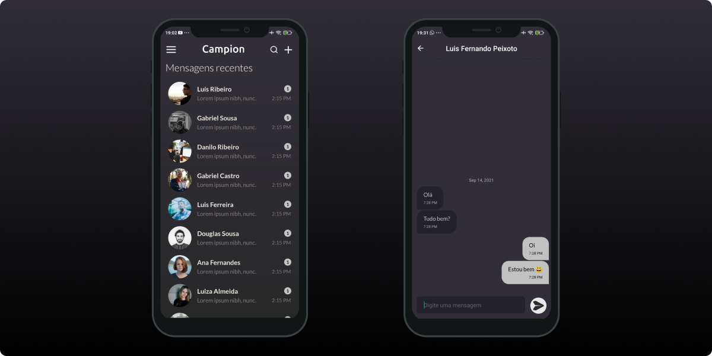
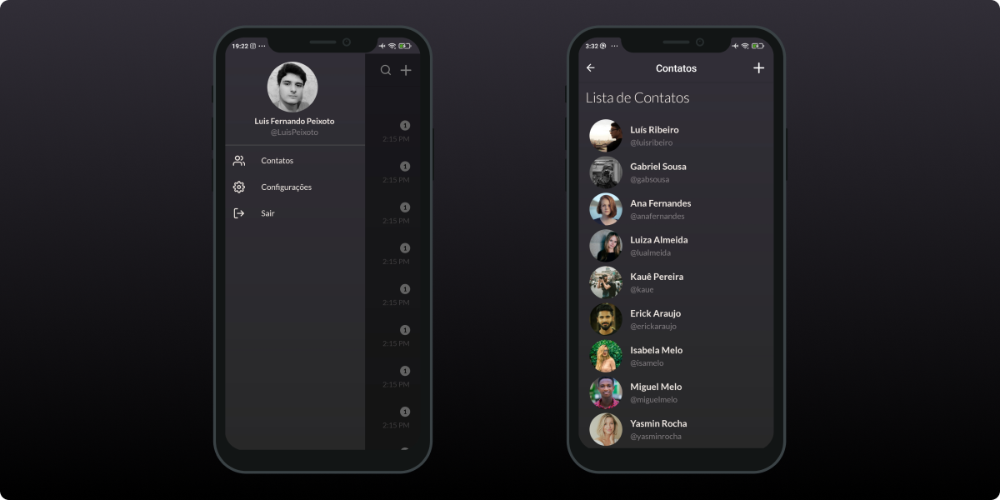

    
# Sobre

Campion, se trata de um aplicativo de troca de mensagens, desenvolvido em react native, onde um usuário pode mandar e receber mensagens facilmente com os demais usuários do aplicativo.

Esse aplicativo foi densenvolvido para trabalho prático da disciplina de Processamento Massivo de Dados. O tema escolhido para o projeto foi a Aplicação de Mensageria: aplicação simples usando um NoSQL para armazenamento + Teste de requisições.


## Screenshots




  
## APK do aplicativo
EM BREVE 

## Instalação

### Clone do repositório

```bash
$ git clone https://github.com/LuisPeixoto/campion

$ cd campion
```

### Instalação das dependências

```bash
$ yarn install
```

### Execução

```bash
$ yarn android
```